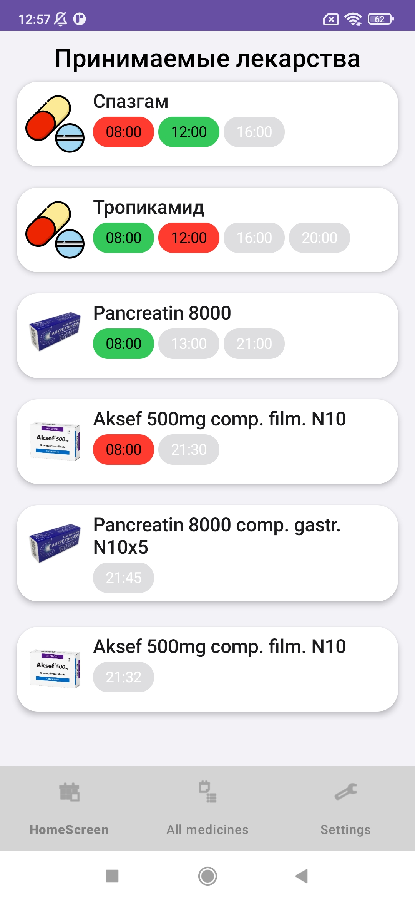
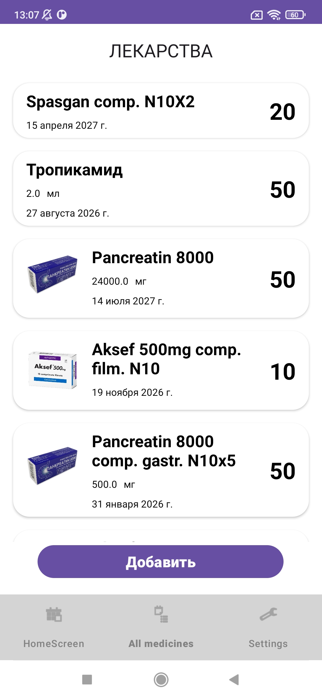
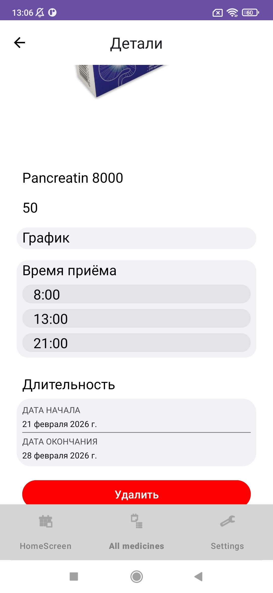
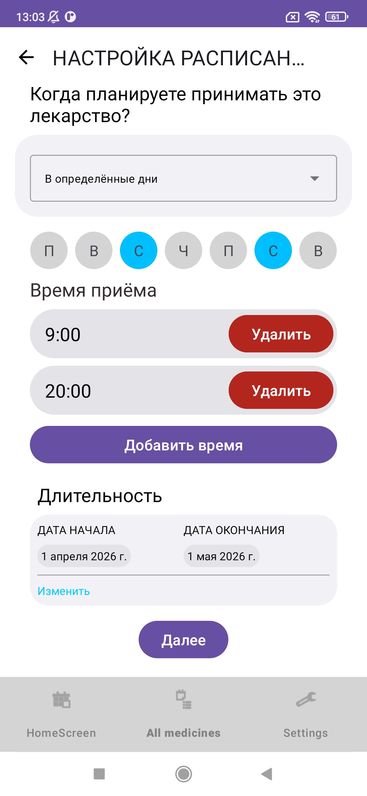

# MedicineCabinet

**MedicineCabinet** is an Android application designed to help users manage their medications and track their intake schedule.
It allows users to store medicines, receive reminders, and monitor whether a dose has been taken.

---

## Features

* Add medicines to a local database
* Track the quantity of each medicine
* Set reminders for medication intake
* Create a custom intake schedule
* Mark medicines as taken or missed
* Search medicines by barcode
* Automatically fetch medicine name and image from a pharmacy website

---

## Tech Stack

* **Kotlin**
* **Android SDK**
* **Jetpack Compose**
* **RecyclerView**
* **Navigation Component**
* **Room Database**
* **ViewModel**
* **Kotlin Coroutines + Flow**
* **Retrofit (REST API)**
* **JSON**
* **CameraX**
* **ML Kit (barcode scanning)**
* **Jsoup (web scraping)**
* **Android Permissions**

---

## Screenshots

<p align="center">
  
  
  
  
</p>

---

## APK

*Coming soon*

---

## Installation

1. Clone the repository:

```bash
git clone https://github.com/your-username/MedicineCabinet.git
```

2. Open the project in **Android Studio**

3. Run on an emulator or a real device

---

## Architecture

The application follows modern Android development practices:

* MVVM (Model-View-ViewModel)
* Reactive data streams (Flow)
* Clean separation of layers (UI / Domain / Data)

---

## Project Status

⚠️ **This project is currently under active development**

Planned features:

* Improved UI/UX
* Advanced notification system
* Data synchronization
* Additional medicine management features

---

## Purpose

This project is part of my Android developer portfolio and demonstrates skills in:

* Application architecture
* Local database management
* Networking and APIs
* Camera and ML integration
* Asynchronous programming1
